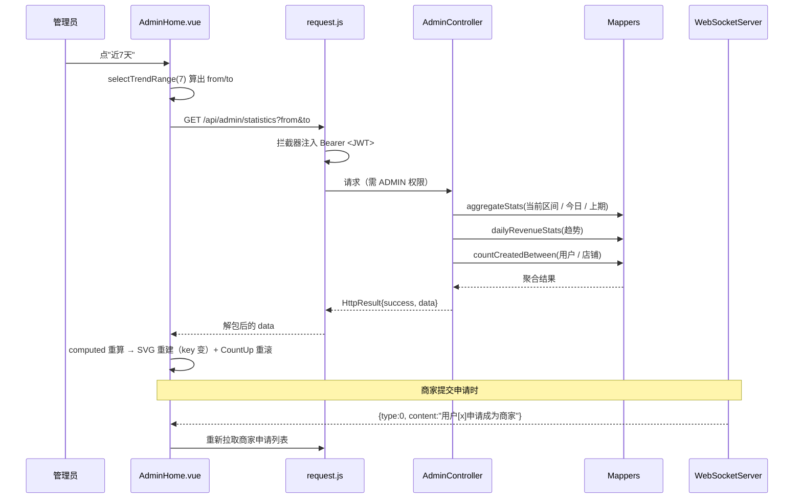

# 前端特色技术 · 答辩速查表

> 项目：外卖平台（elmclient 前端 + elm_bk 后端）
> 用法：第 1 页背下来，第 2 页起是备查手册。答辩前 10 分钟扫一遍即可。

---

## 【第一页】只背这一页

### 1. 30 秒开场（原话照念）

> "我们前端是 Vue 3 + Composition API。整个项目**没有引入 UI 组件库和图表库**，界面、图表、动效、主题都是自己实现的，重点是三块：**数据可视化、动效体系、工程规范**。后端是 Spring Boot 3 + MyBatis + JWT。"

### 2. 技术栈一句话

| 项 | 选型 |
|---|---|
| 框架 | Vue 3（`<script setup>` 组合式 API）+ Vue Router 4 + vue-cli 5 |
| 状态 | 组件内 `ref` / `computed`，无 Vuex/Pinia（页面独立，无需全局状态） |
| 请求 | axios 二次封装（拦截器） |
| 图表 | **手写 SVG**（无 ECharts） |
| 动效 | 纯 CSS + Web Animations + View Transitions API（无 GSAP） |
| 图标/动画 | font-awesome 4、vue-countup-v3（数字滚动）、vue3-lottie（空态动画） |
| 后端 | Spring Boot 3 + MyBatis（注解 SQL）+ JWT + WebSocket + MySQL |

### 3. 六个特色（一句话 + 代码位置）

| # | 特色 | 一句话说法 | 代码位置 |
|---|---|---|---|
| 1 | **手写 SVG 折线图** | 坐标自己算，折线用 `pathLength` + dashoffset 做生长动画 | `src/views/AdminHome.vue` 92–107（模板）、222–258（计算）、543–545（关键帧） |
| 2 | **动效五层体系** | 路由层 / 页面层 / 列表层 / 反馈层 / 数据层 | 见下方第 4 节 |
| 3 | **共享元素转场** | 卡片图片和标题"飞"到详情页，用浏览器原生 View Transitions API | `src/utils/navigationMotion.js`、`BusinessList.vue:43,46`、`BusinessInfo.vue:16,19` |
| 4 | **环形擦除转场** | 从点击的按钮炸开一个圆铺满屏幕再换页 | `src/utils/routeMotion.js`、`App.vue:3-9,194-216`、`Login.vue:254-266` |
| 5 | **设计令牌换肤** | 颜色、动效时长全部走 CSS 变量，改一处全站生效 | `src/assets/styles/design-system.css`、`rider-motion.css:3-8` |
| 6 | **动效可测试 + 可降级** | 计算抽成纯函数跑单测；22 个文件支持 `prefers-reduced-motion` | `src/utils/merchantMotion.js`、`tests/merchant-motion.test.mjs` |

### 4. 动效五层（背这个顺序，逻辑最清楚）

| 层次 | 时机 | 技术 | 代码位置 |
|---|---|---|---|
| ① 路由层 | 切换页面 | 环形擦除 `clip-path: circle()` / View Transitions API | `App.vue`、`utils/routeMotion.js`、`utils/navigationMotion.js` |
| ② 页面层 | 进入页面 | `requestAnimationFrame` 切类 + 分组错峰延迟 | `AdminHome.vue:281,471-478`、`Index.vue:551`、`interaction-motion.css:60-70` |
| ③ 列表层 | 数据增删/滚动 | `TransitionGroup` + 离场前固定尺寸 + `IntersectionObserver` | `RiderDashboard.vue:87`、`MerchantOrders.vue:12`、`utils/merchantMotion.js`、`Index.vue:382` |
| ④ 反馈层 | 点击/操作 | 按压缩放、加购弹跳、导航图标弹跳、脉冲 | `interaction-motion.css:17`、`BusinessInfo.vue:329-332`、`Footer.vue:115` |
| ⑤ 数据层 | 数据到达 | SVG 描边绘制 + 数字滚动 | `AdminHome.vue:98`（折线）、`rider-motion.css:103`（打勾） |

### 5. 三个"独门武器"的一句话解释

1. **共享元素转场**：两个页面给同一元素起**相同的 `viewTransitionName`**，浏览器自动形变过去。兼容性用 `typeof document.startViewTransition !== 'function'` 判断后降级为普通跳转。
2. **环形擦除**：全屏色块 `clip-path: circle(0 at 点击坐标)` 动画到 `circle(150vmax ...)`，用它**盖住页面切换的瞬间**，用户感觉是"圆扩散开就到了新页面"。
3. **同一原理复用两次**：`pathLength="1"` + `stroke-dashoffset: 1→0`，既画折线（`chart-line-draw`）又画成功打勾（`rider-check-draw`）。

### 6. 演示顺序（现场只需要 40 秒）

1. 打开管理端看板 → 讲解"三张指标卡 + 这张折线图是我手写的" → **点"近7天/近30天"让折线重画**
2. 点首页商家卡片 → **图片和店名飞到详情页**（共享元素）
3. 退出 → 登录 → **从登录按钮炸开的环形擦除**
4. （可选）把系统"减少动态效果"打开 → 所有动画消失、功能不变

---

## 【第二页起】备查手册

### A. 数字看板：前端实现

| 内容 | 位置 |
|---|---|
| 模板整体（1–174 行） | 头图 / 名片 / 筛选区 / 指标卡 / 趋势图 / 订单概览 / 审核双 Tab / 弹窗 |
| 状态与派生 | `ref` 20+ 个；`computed` 做数据兜底：`Number(detailedStats.value?.completedCount \|\| 0)` |
| 图表计算链 | `chartValues → chartMax → chartTicks / chartPoints → chartPolyline / chartAreaPath / chartLabels / chartPeak` |
| 坐标公式 | $x = 34 + \dfrac{316 \cdot i}{n-1}$，$y = 146 - \dfrac{128 \cdot v}{v_{max}}$（画布 360×170） |
| 数据请求 | `Promise.all` 并发 3 个接口；`/api/admin/statistics?from&to` |
| 导出 CSV | `responseType: 'blob'` → `URL.createObjectURL` → 动态 `<a download>` → `revokeObjectURL` |
| 生命周期 | `onMounted` 初始化日期区间 + 5 个请求 + WebSocket；`onUnmounted` 取消 rAF + 停止连接 |
| 动画重播 | `:key="chartAnimationKey"`（数据指纹）→ 数据一变 SVG 重建、动画重播 |

**三个必须能答的"为什么"**

- **为什么不用 ECharts？** 只有一条单折线，ECharts 体积几百 KB 且样式/动画难与主题统一；手写 SVG 约 30 行，配色走 CSS 变量、动画时长自主可控。**如果将来要多轴、缩放、大数据量，就换专业图表库。**（主动说局限 = 加分）
- **`pathLength="1"` 干什么用？** 把整条路径长度归一化成 1，于是 `stroke-dasharray: 1; stroke-dashoffset: 1→0` 就是"从 0 画满"，**不用 JS 去量 `getTotalLength()`**。
- **`:key` 打在 `<svg>` 上有什么用？** Vue diff 发现 key 变了会**销毁重建**整个 SVG，CSS 动画状态因此重置——这是"数据变了动画重播"的一行实现。

### B. 数字看板：后端实现（elm_bk）

| 内容 | 位置 |
|---|---|
| 控制器 | `src/main/java/elm_bk/controller/AdminController.java`（121 行） |
| 类级权限 | `@RequestMapping("/api/admin")` + `@PreAuthorize("hasAuthority('ADMIN')")` |
| 三个数字卡 | `countUser` → `UserMapper.count()`；`countBusiness` → `BusinessMapper.count()`（**只算 `status=1`**）；`countPrice` → `OrdersMapper.countPrice()` |
| 主力接口 | `GET /statistics`，默认区间 30 天 |
| 区间写法 | `to.plusDays(1)` + SQL `order_date < #{to}` → **左闭右开**，包含用户选的最后一天 |
| 三段查询 | 当前区间 summary / 今日 today / 上一周期 previous（用于环比） |
| 聚合 SQL | `OrdersMapper.aggregateStats`：`SUM(CASE WHEN order_state=7 THEN 1 ELSE 0 END)` 一条 SQL 出 4 个计数 |
| 折线 SQL | `OrdersMapper.dailyRevenueStats`：`GROUP BY DATE_FORMAT(order_date,'%Y-%m-%d')` |
| 金额精度 | `BigDecimal` + `RoundingMode.HALF_UP`，保留 1 位；**除零返回 `0.0`** |
| 环比口径 | 人数返回**差值**；营收返回**百分比**，**上期为 0 时返回 `null`** → 前端显示 `—` |
| CSV 导出 | 拼接字符串 + `Content-Disposition: attachment` + **`\uFEFF` BOM**（Excel 中文不乱码） |
| 统一返回 | `HttpResult{success, code, data, message}` → 对应前端 `if (response?.success)` |
| 实时推送 | `PermissionApplicationServiceImpl` 构造 `{type:0/1, content}`，经 `NotificationDispatcher.sendToAuthority("ADMIN", ...)` 推送 |
| 推送时机 | `NotificationDispatcher.afterCommit(...)`：**事务提交后才推**，推送失败不影响业务 |
| WebSocket | `websocket/WebSocketServer.java`：`@ServerEndpoint("/ws/{sid}")`、握手校验 JWT、`Map<String, Set<Session>>` 支持一人多端 |
| 鉴权链 | `config/SecurityConfig.java`：STATELESS + JWT 过滤器，`/api/admin/**` 落 `authenticated()` + 类级 `@PreAuthorize` 双重把关 |

**看板数据流（时序）**

### C. 高频追问 · 标准答法（20 条）

| 问 | 答 |
|---|---|
| 为什么不用 Element Plus / Vant？ | 手机端页面布局与视觉是定制的，组件库反而要大量覆盖样式；我们只用了 font-awesome 图标，样式全部自己写 |
| 为什么不用 ECharts？ | 单折线场景体积不划算、样式与主题难统一；复杂图表会换库 |
| SVG 和 Canvas 怎么选？ | Canvas 适合海量数据点；SVG 是 DOM，样式/动画/无障碍友好，我们数据量 ≤90 点，选 SVG |
| SVG 里改文字颜色用什么？ | `fill`，不是 `color` |
| 折线"生长"动画的原理？ | `pathLength="1"` 归一化 + `stroke-dasharray: 1` + `stroke-dashoffset: 1→0` |
| 数据变了动画怎么重播？ | 把数据指纹绑到 `<svg>` 的 `:key`，key 变 → DOM 重建 → 动画重放 |
| 为什么用 `requestAnimationFrame` 切进场类？ | 直接置 true 时浏览器可能还没渲染初始隐藏态，动画会被跳过；等下一帧再切类才能 100% 播出 |
| 错峰延迟怎么做的？ | `nth-child` 设 `animation-delay`（200/300/400ms）；列表用 CSS 变量 `--stagger-index` × 80ms |
| 共享元素转场怎么实现？ | View Transitions API，两页面同一元素起相同 `viewTransitionName`，跳转用 `document.startViewTransition` 包裹 |
| 不支持 View Transitions 的浏览器呢？ | `typeof document.startViewTransition !== 'function'` 时直接 `router.push`，功能不丢 |
| 环形擦除为什么不用 `scale`？ | `scale` 会把内容一起拉伸变形；`clip-path: circle()` 只裁形状 |
| 列表增删时卡片会"跳"，怎么解决？ | 离场前用 `pinMerchantCard` 把 `left/top/width/height` 写成行内样式固定住，动画结束再清掉（FLIP 思路） |
| 滚动揭示怎么做的？ | `IntersectionObserver`，`root` 指到内层滚动容器 `.content`；不支持则全部直接显示 |
| 动画多会不会卡？ | 只动 `transform` 和 `opacity`（走合成层），不动 `width/height/top`；必要处 `will-change` 提示；不用 JS 逐帧 |
| 无障碍怎么保证？ | 22 个文件支持 `prefers-reduced-motion`（CSS 关动画 + JS 里也判断）；图表 `role="img"` + `aria-label`；弹窗 `role="dialog" aria-modal`；图标按钮有 `aria-label` |
| 手机上的 hover 怎么处理？ | 只在 `@media (hover: hover) and (pointer: fine)` 启用悬停，触摸设备只保留 `:active`，防"悬停粘住" |
| 前端动效怎么测试？ | 把计算抽成不依赖 Vue 的纯函数（`utils/merchantMotion.js`），用 `node --test` 直接断言 CSS 变量与尺寸 |
| 请求层做了什么？ | axios 实例 + 请求拦截器自动带 JWT（登录/注册除外）、**拒绝向非平台域名发请求**；响应拦截器解包 body；401 仅在"原本有登录态"时跳登录页（防游客循环跳转） |
| 实时通知怎么做的？ | WebSocket 保持长连接，按角色定向推送；前端收到后 `toast` 提示并**只重拉对应列表**；退出登录先断开连接再清登录态 |
| 你觉得还有什么可改进？ | 见下方第 D 节（**主动说，最能加分**） |

### D. 可改进点（主动说出来 = 加分项）

1. **`orders` 表缺统计索引**：`db/schema/elm_v2.sql` 里 orders 只有 `business_id/customer_id/address_id` 索引，而统计 SQL 全按 `order_date + order_state` 过滤，数据量上来会全表扫描。建议加 `INDEX idx_orders_date_state (order_date, order_state, is_deleted)`。
2. `AdminController` 的 `@PreAuthorize` 类上、方法上重复写了两次，可删掉方法上的。
3. `aggregateStats` 的 `completedCount` 等字段没 `COALESCE`，无数据时返回 `null`，目前靠前端 `|| 0` 兜底，后端统一包一层更稳。
4. 趋势折线只返回"有订单的日期"，x 轴是等距的而非真实时间轴；如需真实时间轴要在后端补零。
5. 统计目前是实时 SQL 聚合、无缓存；数据量大时可加 Redis 或预聚合表。
6. `AdminHome.vue` 用动态标题当 `id`（`<h2 :id="modalTitle">`），严格说 `aria-labelledby` 应指向固定 id。

### E. 一句话总结（收尾用）

> "**界面、图表、动画都是自己实现的，不是组件库拼的**；而且是分层做的——路由层管转场、页面层管入场、列表层管增删、反馈层管手感、数据层管可视化，每一层都做了降级和测试。"
